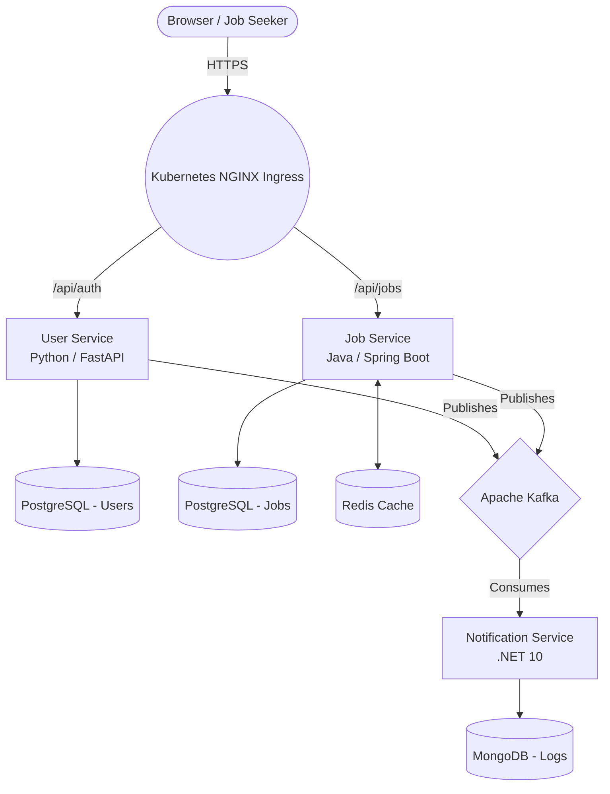

# TalentFlow: System Architecture & Design

This document outlines the complete architectural design, data flows, and infrastructure patterns for the **TalentFlow** platform. 

It is designed using an **Event-Driven Microservices pattern** to handle high throughput, maintain resilience against partial system failures, and act as a modern DevOps implementation sandbox.

---

## 1. High-Level System Context

At its core, TalentFlow connects "Job Seekers" to "Job Postings".
Instead of building a giant monolithic server that does everything, the business logic is fractured into three completely independent microservices. 

This enables different teams to write in different languages (Polyglot programming) and allows independent horizontal scaling in Kubernetes.

---

## 2. Component Details & Behavior

### A. The User Service (Auth & Identity)
* **Stack:** Python 3.11, FastAPI, SQLAlchemy
* **Port:** 8001
* **Database:** PostgreSQL (Schema: `users`)
* **Behavior:** Total ownership of identity. When a user registers, it securely hashes their password locally and creates an identity. It generates `JWT` (JSON Web Tokens) that the React frontend uses to prove to other services who the user is.
* **Events Emitted:** Fire-and-forget `user.registered` event into Kafka.

### B. The Job Service (Core Business Logic)
* **Stack:** Java 17, Spring Boot 3, Hibernate 6
* **Port:** 8080
* **Database:** PostgreSQL (Schema: `jobs`) & Redis
* **Behavior:** Holds the source of truth for all job postings and applications.
  * **Read-heavy Optimization:** Uses **Redis** caching. Because checking thousands of jobs is slow, Job Service asks Postgres once, puts the result in Redis, and serves the next 1,000 users directly from RAM.
* **Events Emitted:** `job.posted` and `application.sent` events into Kafka.

### C. The Notification Service (Async Processor)
* **Stack:** C# / .NET 10 / ASP.NET
* **Port:** 8002
* **Database:** MongoDB
* **Behavior:** It has no public-facing REST API for users. It is purely a background worker. It continuously listens to the Kafka Event Bus. When it sees an `application.sent` event, it wakes up, dynamically generates a heavily-formatted HTML email, fires it to an external SMTP provider (currently mocked), and logs the exact timestamp into MongoDB. 
* **Why Mongo?** Notification logs are completely unstructured documents with unpredictable metadata payloads. A NoSQL database handles this far better than strict SQL tables.

### D. The Job Aggregator (Automation/Cron)
* **Stack:** Python Script
* **Orchestrator:** Kubernetes `CronJob`
* **Behavior:** Wakes up every 6 hours, hits external APIs (like Arbeitnow and Remotive), formats external jobs into TalentFlow's JSON schema, and fires them directly into the Java Job Service. It then immediately terminates to free up CPU resources.

---

## 3. The Communication Layer

TalentFlow uses both **Synchronous** and **Asynchronous** communication.

### Synchronous (REST APIs)
Used when the user *absolutely must* wait for an immediate answer before proceeding.
* Example: Logging in. A user types their password, hits submit, and the UI freezes for 300ms waiting for the User Service to guarantee the password is correct via HTTP 200 OK.

### Asynchronous (Event-Driven via Apache Kafka)
Used when tasks are non-critical to the immediate user experience.
* Example: Sending an email receipt after applying for a job. The user doesn't want to wait 5 seconds looking at a loading spinner while the system talks to an email server. 
* We use **Kafka** to decouple this. Java tells the user "Successfully Applied" instantly, leaving the heavy lifting of sending the email to the .NET service to process at its own un-rushed pace.

#### Kafka Topics Mapping:
* `user.registered`: Picked up by Notification Service to send a "Welcome to Talentflow!" onboarding email.
* `job.posted`: (Future implementation) Picked up by an analytics engine or used to notify job seekers matching the exact criteria.
* `application.sent`: Picked up by Notification Service to send a PDF receipt of the cover letter to the user.

---

## 4. DevOps & Cloud Infrastructure Delivery

Code doesn't just magically appear in production. TalentFlow enforces an automated `GitOps` mindset.

1. **Commit:** A developer finishes work and pushes to the `main` branch.
2. **Continuous Integration (CI):** GitHub Actions detects the push. It boots an Ubuntu runner, compiles the code natively, runs the xUnit/JUnit/Pytest testing suites, and uses **Trivy** to scan the code for critical security vulnerabilities.
3. **Containerization:** Once passing, Docker packages the app into an ultra-lightweight image and uploads it to GitHub Container Registry (`GHCR`).
4. **Continuous Deployment (CD):** GitHub Actions logs into the Azure Cloud without passwords (using OIDC tokens), injects the latest Image SHA tag into the raw Kubernetes `.yaml` manifests, and executes `kubectl apply`.
5. **Orchestration:** The Azure Kubernetes Service (AKS) downloads the fresh Docker Images and performs a "Rolling Update", bringing up the new code and shifting traffic over without dropping a single user request.

---

## 5. Security & Observability boundaries

* **Tracing:** Since a single user request (Applying for a Job) travels across React -> Ingress -> Java -> Kafka -> .NET, tracking a bug is extremely difficult. TalentFlow uses **Jaeger / OTLP (OpenTelemetry)** to inject a microscopic trace-ID on every step, mapping out exactly how many milliseconds the packet spent in each cloud component.
* **Access Control:** The `.NET Notification Service` database (MongoDB) is strictly guarded entirely within an internal Kubernetes network namespace. It has no external port open to the internet, securing it against direct brute-force connections.
